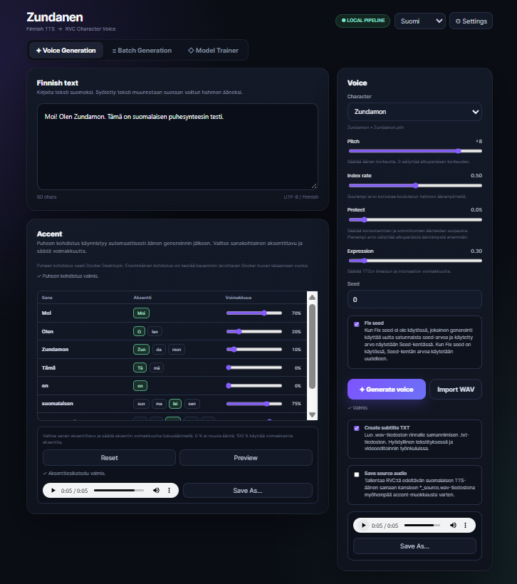

# Zundanen v1.0.0

**Suomi | [日本語](README_JA.md) | [English](README_EN.md)**

Zundanen on paikallinen Windows-sovellus, joka muuntaa suomenkielisen tekstin ketjulla **Finnish-NLP/Chatterbox-Finnish → RVC** ja tuottaa WAV-tiedostoja paikallisilla RVC-äänimalleilla.

Samassa käyttöliittymässä ovat **Batch Generation**, valinnainen sanakohtainen **Accent**-muokkaus sekä **Model Trainer**, jolla voi kouluttaa RVC v2 -mallin (`.pth + .index`) äänikansiosta.



## Käyttöohjevideo

[https://youtu.be/e5rfWdmxM20?si=ouU6rzhPJ9XnrOmY](https://youtu.be/e5rfWdmxM20?si=ouU6rzhPJ9XnrOmY)

## Vaatimukset

- Windows 11 x64
- WinGet (yleensä mukana Windows 11:n App Installerissa)
- NVIDIA GPU suositeltu
- Model Trainer vaatii tällä hetkellä NVIDIA CUDA GPU:n
- Voice Generation toimii myös CPU:lla, mutta voi olla hyvin hidas
- Useita gigatavuja vapaata levytilaa suositellaan
- **Vain Accent-muokkaus tarvitsee valinnaisesti WSL2:n ja Docker Desktopin**

Tavallinen Voice Generation, Batch Generation ja Model Trainer eivät tarvitse Dockeria.

## Asennus

Lataa projekti GitHubista kohdasta `Code → Download ZIP` ja pura se lyhyeen polkuun, esimerkiksi:

```text
C:\Zundanen
```

Kaksoisnapsauta sitten `setup.bat`.

Normaali asennus valmistelee muun muassa:

```text
Microsoft Visual C++ Redistributable
Microsoft Edge WebView2 Runtime
Git
FFmpeg
Python 3.11 + Finnish-NLP/Chatterbox-Finnish
Python 3.12 + RVC-WebUI
HuBERT / RMVPE / RVC pretrained assets
```

TTS ja RVC käyttävät erillisiä virtuaaliympäristöjä `runtime/`-hakemiston alla.

> WSL2:ta, Docker Desktopia, Aalto-kohdistusta ja PyWORLDia ei asenneta normaalilla `setup.bat`-ajolla. Ne voi lisätä tarvittaessa Accent-osion `Install Accent support` -painikkeella.

### Windowsin polkupituus

Joissakin Python-paketeissa on pitkiä sisäisiä polkuja. Liian syvälle purettu kansio voi aiheuttaa `WinError 206` -virheen. Lyhyt polku kuten `C:\Zundanen` on suositeltava.

### Asennuksen uudelleenajo

Jos asennus keskeytyy, korjaa syy ja suorita `setup.bat` uudelleen. Olemassa olevia osia hyödynnetään mahdollisuuksien mukaan.

Ympäristön voi rakentaa kokonaan uudelleen komennolla:

```powershell
powershell -ExecutionPolicy Bypass -File .\setup.ps1 -Force
```

## Käynnistys

Asennuksen jälkeen suositeltu tapa on kaksoisnapsauttaa `Zundanen.exe`.

Se käynnistää paikallisen palvelimen taustalle ja näyttää käyttöliittymän omassa WebView2-ikkunassa. Ikkunan sulkeminen lopettaa myös paikallisen palvelimen.

> `Zundanen.exe` ei ole tällä hetkellä koodiallekirjoitettu, joten Windows SmartScreen voi näyttää varoituksen. Pienen Windows-käynnistimen lähdekoodi on hakemistossa `launcher_src/`.

Selainversion voi käynnistää tiedostolla `run_ui.bat`:

```text
http://127.0.0.1:8765
```

Jos olemassa olevaan asennukseen halutaan lisätä vain desktop-UI:n riippuvuus, käytä `install_desktop.bat`.

### EXE-käynnistimen rakentaminen uudelleen

Repository sisältää käynnistimen lähdekoodin:

```text
launcher_src/zundanen_launcher.go
```

`build_launcher.bat` rakentaa siitä uuden tiedoston:

```text
dist\Zundanen.exe
```

Go-työkaluketjua tarvitaan vain silloin, kun käynnistin halutaan rakentaa uudelleen. Tavallinen käyttäjä ei tarvitse Goa. TTS-, RVC- ja mallikomponentit pysyvät projektin `runtime/`-hakemistossa eikä niitä pakata EXE-tiedostoon.

## Voice Generation

1. Valitse `Character`
2. Kirjoita suomenkielinen teksti
3. Säädä tarvittaessa `Pitch` / `Index rate` / `Protect` / `Expression`
4. Tarkista `Seed`. Kun `Fix seed` on pois käytöstä, jokainen generointi saa uuden satunnaisen seedin; käytössä ollessaan syötetty seed käytetään uudelleen
5. Paina `Generate voice`
6. Muokkaa halutessasi Accentia
7. Tallenna `Save As...` -painikkeella

Ehdotettu tiedostonimi sisältää päivämäärän/kellonajan ja TTS-seedin:

```text
Zundamon_20260916_180000_seed123456.wav
```

Tallennusasetukset:

- `Create subtitle TXT` — tallentaa samannimisen `.txt`-tiedoston; oletuksena käytössä
- `Save source audio` — tallentaa puhtaan Finnish TTS -äänen ennen RVC:tä myöhempää korkealaatuista Accent-muokkausta varten; oletuksena pois käytöstä

Kun source audio on käytössä:

```text
Zundamon_20260916_180000_seed123456.wav
Zundamon_20260916_180000_seed123456.txt             # jos TXT on käytössä
Zundamon_20260916_180000_seed123456_source.wav
Zundamon_20260916_180000_seed123456_source.json
```

`_source.json` sisältää metatiedot, joiden avulla alkuperäiset RVC-asetukset voidaan palauttaa myöhemmin.

RVC-mallit tunnistetaan normaalisti esimerkiksi rakenteesta:

```text
runtime/rvc/exports/
├─ CharacterA/
│  ├─ CharacterA.pth
│  └─ CharacterA.index
└─ CharacterB/
   ├─ CharacterB.pth
   └─ CharacterB.index
```

## Accent

Accent on valinnainen ominaisuus. Jos riippuvuudet puuttuvat, Accent-osiossa näkyy:

```text
Install Accent support
```

Asennin tarkistaa ja lisää vain puuttuvat Accent-komponentit:

- PyWORLD / WORLD vocoder
- WSL2
- Docker Desktop
- Aalto Finnish forced alignment -Docker image

WSL2:n ensimmäinen käyttöönotto voi vaatia Windowsin uudelleenkäynnistyksen. Käynnistyksen jälkeen avaa Zundanen ja paina `Install Accent support` uudelleen.

Kun Accent support on asennettu, puheen kohdistus käynnistyy automaattisesti Voice Generationin jälkeen. Zundanen kohdistaa suomenkielisen tekstin ääneen ja näyttää tavupainikkeet jokaiselle sanalle.

- valitse sanan aksenttitavu
- säädä `Strength`
- palauta muutokset `Reset`-painikkeella
- kuuntele tulos `Preview` -painikkeella

Aalto-kohdistus määrittää tavujen ajoituksen. WORLD/PyWORLD muokkaa RVC:tä edeltävää ääntä, jonka jälkeen RVC ajetaan.

### Import WAV

`Import WAV` avaa aiemmin tallennettuja Voice Generation- tai Batch Generation -tuloksia uudelleen.

- samanniminen `.txt` luetaan automaattisesti, jos se löytyy
- Voice Generationin `*_source.wav` / `*_source.json` tunnistetaan automaattisesti
- Batch Generationin `source_audio/`-kansion vastaava source tunnistetaan automaattisesti
- source audion löytyessä käytetään laadukkaampaa pre-RVC → WORLD → RVC -reittiä
- vanhat/ulkoiset WAV-tiedostot ilman source audiota muokataan varareittinä suoraan WORLDilla

## Batch Generation

Batch Generation käsittelee useita tekstejä peräkkäin ja estää Windowsin automaattisen lepotilan jonon aikana.

Syöttötavat:

```text
One line = one WAV
CSV
```

Jokainen tiedostonimi sisältää seedin, esimerkiksi:

```text
001_seed123456.wav
002_seed987654.wav
```

CSV-sarakkeet:

```text
filename,text,character,pitch,index_rate,protect,expression,seed
```

Vain `text` on pakollinen. Tyhjä `filename` tuottaa esimerkiksi `001_seed123456.wav`; arvo `intro` tuottaa `001_intro_seed123456.wav`.

Kun `Fix seed` on pois käytöstä, jokainen jonon kohde saa uuden satunnaisen seedin. Kun se on käytössä, Batch-näkymän Seed-arvoa käytetään uudelleen. CSV-rivin `seed` ohittaa Batch-asetuksen.

Tallennusasetukset:

- `Create subtitle TXT` — luo samannimisen `.txt`-tiedoston; oletuksena käytössä
- `Save source audio` — tallentaa Finnish TTS -lähdeäänen ennen RVC:tä; oletuksena pois käytöstä

Kun source audio on käytössä, kaikki Batch-lähteet tallennetaan `source_audio/`-kansioon:

```text
outputs/batches/20260916_180000_ab12cd/
├─ 001_seed123456.wav
├─ 001_seed123456.txt
├─ 002_seed987654.wav
├─ 002_seed987654.txt
├─ source_audio/
│  ├─ 001_seed123456_source.wav
│  ├─ 001_seed123456_source.json
│  ├─ 002_seed987654_source.wav
│  └─ 002_seed987654_source.json
└─ failed_items.csv            # vain jos virheitä esiintyi
```

Jonon tila tallennetaan automaattisesti, ja keskeytettyä jonoa voi jatkaa `Resume Queue` -painikkeella.

## Model Trainer

`Model Trainer` -välilehdellä voidaan määrittää:

- Character name
- Dataset folder
- Epochs
- Batch size
- Save every
- Workers
- GPU
- Fresh training

Koulutusputki:

```text
Audio dataset
  ↓
Preprocess / 40 kHz
  ↓
RMVPE F0
  ↓
HuBERT v2 / 768-dim
  ↓
RVC v2 training
  ↓
FAISS index
  ↓
runtime/rvc/exports/<Character>/<Character>.pth
runtime/rvc/exports/<Character>/<Character>.index
```

Windowsin automaattinen lepotila estetään koulutuksen ajaksi ja palautetaan koulutuksen päätyttyä tai keskeytyessä.

## Käyttöliittymän kielet

Ohje- ja seliteteksti voidaan vaihtaa kielille `Suomi / 日本語 / English`. Oletuskieli on Suomi ja valinta tallennetaan paikallisesti.

Painikkeet, tekniset nimet ja osa tilateksteistä pidetään tarkoituksella englanniksi.

## Asennuksen tarkistus

Suorita:

```powershell
powershell -ExecutionPolicy Bypass -File .\doctor.ps1
```

Doctor tarkistaa normaalitoimintojen vaatiman TTS/RVC-ympäristön. Docker näytetään vain valinnaisena Accent-komponenttina.

## GitHub Actions

Repository sisältää:

```text
.github/workflows/windows-smoke.yml
```

Pushin ja pull requestin yhteydessä GitHub tarkistaa automaattisesti muun muassa:

- `setup.ps1`, `doctor.ps1` ja `install_accent_support.ps1` -skriptien syntaksin
- pienen Go-pohjaisen Windows-käynnistimen compiloinnin
- kevyen CI-setupin ja keskeisten Python-tiedostojen compiloinnin
- Flask-käyttöliittymän käynnistymisen
- `/api/state`-rajapinnan HTTP 200 -vastauksen

Tavallinen GitHub-hosted runner ei testaa varsinaista CUDA-TTS/RVC-generointia eikä Docker-pohjaista puheen kohdistusta. Asennus, TTS-generointi, RVC-äänimuunnos sekä Accent-muokkaus on kuitenkin testattu erikseen Windows 11 -ympäristössä.

## Mitä GitHubiin ei tallenneta

`.gitignore` jättää pois esimerkiksi:

```text
runtime/
config.json
outputs/
temp/
__pycache__/
```

Ladatut mallit, virtuaaliympäristöt, käyttäjäasetukset, RVC-mallit ja generoidut äänet eivät näin normaalisti päädy repositoryyn.

## Ääni- ja hahmooikeudet

Zundanenin MIT-lisenssi ei anna oikeuksia kolmansien osapuolten hahmoääniin, koulutusdataan tai RVC-malleihin.

Jos käytät, julkaiset tai jaat kolmannen osapuolen ääntä, datasettejä, `.pth`- tai `.index`-tiedostoja, tarkista aina kyseisen oikeudenhaltijan, äänikirjaston ja datasetin käyttöehdot.

## Upstream-projektit

- Finnish-NLP/Chatterbox-Finnish: https://huggingface.co/Finnish-NLP/Chatterbox-Finnish
- ResembleAI Chatterbox: https://github.com/resemble-ai/chatterbox
- RVC: https://github.com/RVC-Project/Retrieval-based-Voice-Conversion-WebUI
- Aalto Finnish Forced Alignment: https://github.com/aalto-speech/finnish-forced-alignment
- Lingsoft aalto-kaldi-align-elg: https://github.com/lingsoft/aalto-kaldi-align-elg
- WORLD: https://github.com/mmorise/World
- PyWORLD: https://github.com/JeremyCCHsu/Python-Wrapper-for-World-Vocoder
- FFmpeg: https://ffmpeg.org/

Lisenssitiedot löytyvät myös tiedostosta `THIRD_PARTY_NOTICES.md`.
